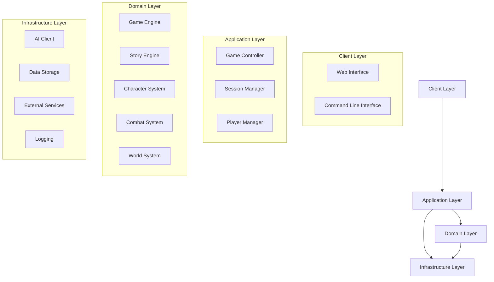

# Design Document: Code Organization and Refactoring

## Overview

This design document outlines the approach for refactoring the Fire Whisper RPG codebase to improve organization, readability, and maintainability. The refactoring will focus on establishing a clear folder structure, consistent naming conventions, well-defined interfaces, and comprehensive documentation. The goal is to create a codebase that is easy to navigate, understand, and extend, facilitating better collaboration among developers.

## Architecture

The refactored codebase will follow a domain-driven design approach with clear separation of concerns. The architecture will be organized around the core domains of the game, with each domain having its own package containing related modules. The architecture will follow a layered approach with clear dependencies between layers.

### High-Level Architecture



## Folder Structure

The refactored codebase will follow this folder structure:

```
fire-whisper-game/
├── .github/                    # GitHub workflows and templates
├── .kiro/                      # Kiro-specific files
│   ├── specs/                  # Feature specifications
│   └── steering/               # Steering files
├── docs/                       # Documentation
│   ├── api/                    # API documentation
│   ├── architecture/           # Architecture documentation
│   ├── guides/                 # User and developer guides
│   └── tutorials/              # Tutorials
├── scripts/                    # Utility scripts
├── src/                        # Source code
│   ├── client/                 # Client interfaces
│   │   ├── cli/                # Command-line interface
│   │   └── web/                # Web interface
│   ├── application/            # Application layer
│   │   ├── controllers/        # Game controllers
│   │   ├── services/           # Application services
│   │   └── dto/                # Data transfer objects
│   ├── domain/                 # Domain layer
│   │   ├── game/               # Game engine and core mechanics
│   │   ├── story/              # Story engine and narrative systems
│   │   ├── character/          # Character systems
│   │   ├── combat/             # Combat systems
│   │   └── world/              # World systems (locations, items, etc.)
│   ├── infrastructure/         # Infrastructure layer
│   │   ├── ai/                 # AI client and integration
│   │   ├── persistence/        # Data storage
│   │   ├── external/           # External service integration
│   │   └── logging/            # Logging and monitoring
│   └── utils/                  # Utility functions and helpers
├── tests/                      # Test code
│   ├── unit/                   # Unit tests
│   ├── integration/            # Integration tests
│   ├── e2e/                    # End-to-end tests
│   └── fixtures/               # Test fixtures
├── experiments/                # Experimental code (clearly separated)
│   └── archived/               # Archived experiments
├── config/                     # Configuration files
├── logs/                       # Log files
├── .gitignore                  # Git ignore file
├── README.md                   # Project README
├── requirements.txt            # Python dependencies
└── setup.py                    # Package setup
```

## Naming Conventions

### File Naming

- Python modules: `snake_case.py`
- Test files: `test_module_name.py`
- Configuration files: `descriptive_config_name.json/yaml`
- Documentation files: `descriptive-name.md`

### Class Naming

- Classes: `PascalCase`
- Follow domain-driven naming: `EntityName`, `ServiceName`, `RepositoryName`
- Abstract classes/interfaces: `AbstractName` or `NameInterface`

### Function and Method Naming

- Functions and methods: `snake_case`
- Use verb phrases that describe behavior: `calculate_damage`, `process_turn`, `generate_response`
- Private methods: `_method_name` (single underscore prefix)

### Variable Naming

- Variables: `snake_case`
- Boolean variables: use prefixes like `is_`, `has_`, `should_`: `is_active`, `has_permission`
- Collections: use plural names: `users`, `items`, `locations`
- Constants: `UPPER_SNAKE_CASE`

## Interface Design

### Domain Interfaces

Each domain will expose clear interfaces for other domains to interact with. These interfaces will be defined as abstract base classes or protocol classes.

Example:

```python
from abc import ABC, abstractmethod
from typing import Dict, List, Any, Optional

class StoryEngineInterface(ABC):
    """Interface for the story engine component."""
    
    @abstractmethod
    def generate_narrative(self, context: Dict[str, Any]) -> str:
        """
        Generate narrative text based on the provided context.
        
        Args:
            context: Dictionary containing context information
            
        Returns:
            Generated narrative text
        """
        pass
    
    @abstractmethod
    def process_player_action(self, action: str, context: Dict[str, Any]) -> Dict[str, Any]:
        """
        Process a player action and update the story state.
        
        Args:
            action: Player action text
            context: Dictionary containing context information
            
        Returns:
            Updated context with story state changes
        """
        pass
```

### Application Service Interfaces

Application services will provide interfaces for the client layer to interact with the domain layer.

Example:

```python
from abc import ABC, abstractmethod
from typing import Dict, List, Any, Optional
from src.application.dto.game_dto import GameStateDTO, PlayerActionDTO, GameResponseDTO

class GameServiceInterface(ABC):
    """Interface for the game service."""
    
    @abstractmethod
    def start_game(self, player_id: str, saga_id: str) -> GameStateDTO:
        """
        Start a new game session.
        
        Args:
            player_id: ID of the player
            saga_id: ID of the selected saga
            
        Returns:
            Initial game state
        """
        pass
    
    @abstractmethod
    def process_turn(self, game_id: str, action: PlayerActionDTO) -> GameResponseDTO:
        """
        Process a player turn.
        
        Args:
            game_id: ID of the game session
            action: Player action data
            
        Returns:
            Game response with updated state
        """
        pass
```

## Data Models

### Domain Models

Domain models will represent the core entities and value objects in the domain. They will be immutable where possible and will encapsulate domain logic.

Example:

```python
from dataclasses import dataclass
from typing import List, Dict, Any, Optional

@dataclass(frozen=True)
class Character:
    """Represents a character in the game."""
    
    id: str
    name: str
    race: str
    profession: str
    attributes: Dict[str, int]
    skills: Dict[str, int]
    inventory: List["Item"]
    
    def calculate_combat_power(self) -> int:
        """Calculate the combat power of the character."""
        # Domain logic for calculating combat power
        base_power = self.attributes.get("strength", 0) + self.attributes.get("dexterity", 0)
        skill_bonus = sum(level for skill, level in self.skills.items() if skill in ["combat", "archery", "magic"])
        return base_power + skill_bonus
```

### Data Transfer Objects (DTOs)

DTOs will be used to transfer data between layers, especially between the application and client layers.

Example:

```python
from dataclasses import dataclass
from typing import List, Dict, Any, Optional

@dataclass
class CharacterDTO:
    """Data transfer object for character data."""
    
    id: str
    name: str
    race: str
    profession: str
    attributes: Dict[str, int]
    skills: Dict[str, int]
    inventory: List[Dict[str, Any]]
```

## Error Handling

### Exception Hierarchy

The codebase will use a consistent exception hierarchy for different types of errors.

```
BaseException
└── Exception
    └── FireWhisperException
        ├── DomainException
        │   ├── InvalidGameStateException
        │   ├── InvalidPlayerActionException
        │   └── StoryGenerationException
        ├── InfrastructureException
        │   ├── AIClientException
        │   ├── PersistenceException
        │   └── ExternalServiceException
        └── ApplicationException
            ├── ValidationException
            ├── AuthorizationException
            └── ResourceNotFoundException
```

### Error Handling Strategy

1. Domain layer: Throw domain-specific exceptions when domain rules are violated
2. Application layer: Catch domain exceptions and translate them to application exceptions
3. Client layer: Catch application exceptions and translate them to appropriate responses
4. Infrastructure layer: Throw infrastructure exceptions when external services fail

## Documentation Strategy

### Code Documentation

1. Module docstrings: Purpose, responsibilities, and usage examples
2. Class docstrings: Purpose, responsibilities, and usage examples
3. Method docstrings: Purpose, parameters, return values, exceptions, and examples
4. Complex algorithms: Step-by-step explanation of the algorithm

Example:

```python
"""
Story Engine Module

This module contains the core story generation and processing logic.
It is responsible for generating narrative text, processing player actions,
and maintaining story coherence.

Example usage:
    story_engine = StoryEngine(ai_client)
    narrative = story_engine.generate_narrative(context)
"""

class StoryEngine:
    """
    Core story generation and processing engine.
    
    This class is responsible for generating narrative text, processing
    player actions, and maintaining story coherence. It uses an AI client
    to generate text and a narrative coherence system to ensure consistency.
    
    Attributes:
        ai_client: AI client for text generation
        coherence_system: System for maintaining narrative coherence
    """
    
    def generate_narrative(self, context: Dict[str, Any]) -> str:
        """
        Generate narrative text based on the provided context.
        
        This method uses the AI client to generate narrative text based on
        the provided context. It ensures that the generated text maintains
        coherence with the existing narrative.
        
        Args:
            context: Dictionary containing context information including:
                - character: Character information
                - location: Current location
                - history: Previous narrative events
                - state: Current game state
                
        Returns:
            Generated narrative text
            
        Raises:
            StoryGenerationException: If narrative generation fails
        """
        # Implementation
```

### Project Documentation

1. README.md: Project overview, installation, quick start
2. Architecture documentation: High-level architecture, design decisions
3. API documentation: API reference, usage examples
4. User guides: How to use the system
5. Developer guides: How to extend and modify the system

## Testing Strategy

### Unit Testing

- Test individual components in isolation
- Use mock objects for dependencies
- Focus on testing domain logic and edge cases

### Integration Testing

- Test interactions between components
- Focus on testing component integration and workflows
- Use test doubles for external dependencies

### End-to-End Testing

- Test complete workflows from user input to system response
- Focus on testing user scenarios and acceptance criteria
- Use real dependencies where possible

## Implementation Plan

The refactoring will be implemented in phases to minimize disruption to ongoing development:

### Phase 1: Initial Structure and Documentation

1. Create the new folder structure
2. Add comprehensive documentation to existing code
3. Create interface definitions for core components

### Phase 2: Core Domain Refactoring

1. Refactor the domain layer
2. Implement domain interfaces
3. Update domain models to follow best practices

### Phase 3: Application Layer Refactoring

1. Refactor the application layer
2. Implement application service interfaces
3. Create DTOs for data transfer

### Phase 4: Infrastructure Layer Refactoring

1. Refactor the infrastructure layer
2. Implement infrastructure interfaces
3. Update external service integrations

### Phase 5: Client Layer Refactoring

1. Refactor the client layer
2. Update client interfaces to use application services
3. Implement error handling and user feedback

### Phase 6: Testing and Validation

1. Implement comprehensive tests
2. Validate the refactored codebase
3. Fix any issues discovered during testing

## Conclusion

This design provides a comprehensive approach to refactoring the Fire Whisper RPG codebase. By following this design, the codebase will be more organized, maintainable, and easier to collaborate on. The clear separation of concerns, consistent naming conventions, and comprehensive documentation will make it easier for developers to understand and extend the system.