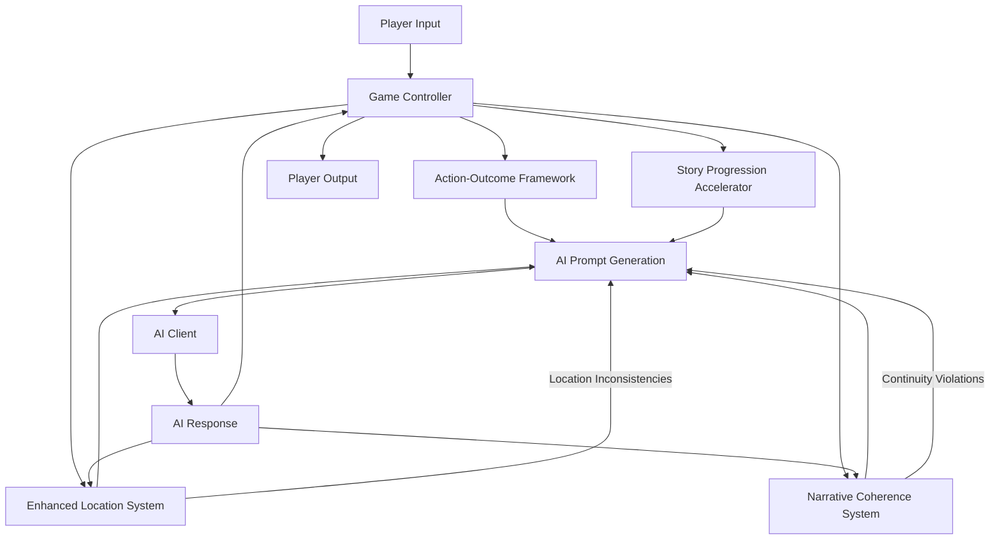

# Design Document: Gameplay Improvements

## Overview

This design document outlines the architecture and implementation details for improving the Fire Whisper RPG gameplay experience. The improvements focus on creating a more engaging, coherent, and meaningful player experience by addressing the key issues identified in the requirements document: repetitive gameplay, narrative inconsistency, poor action resolution, and technical bugs.

The design follows a "Guided Creativity with Guardrails" approach, using AI for creative content generation while implementing strict technical controls to maintain game coherence and meaningful player impact. The systems are designed to work together to create a cohesive gameplay experience that respects player choices and maintains narrative consistency.

## Architecture

The gameplay improvements will be implemented through four core systems that work together:

1. **Action-Outcome Framework** - Handles the resolution of player actions with varied, meaningful outcomes
2. **Narrative Coherence System** - Maintains consistent narrative elements across turns
3. **Story Progression Accelerator** - Ensures stories reach meaningful points by appropriate turns
4. **Enhanced Location System** - Improves location detection, transitions, and consistency

These systems will integrate with the existing game engine and AI components through well-defined interfaces. The architecture follows a modular design pattern, allowing each system to be developed, tested, and maintained independently while working together to create a cohesive gameplay experience.

### System Integration Diagram



## Components and Interfaces

### 1. Action-Outcome Framework

The Action-Outcome Framework replaces the binary success/failure model with a spectrum of outcomes, each with specific narrative templates and game state changes.

#### Key Components:

- **OutcomeResolver** - Determines the outcome category based on action type, risk level, and dice roll
- **NarrativeTemplateManager** - Manages templates for different outcome types and action categories
- **StateChangeApplier** - Applies appropriate state changes based on outcome type
- **AIPromptGenerator** - Creates prompts for AI to generate varied, engaging responses

#### Interface:

```python
class ActionOutcomeFramework:
    def resolve_action(self, action_type: str, risk_level: str, roll_result: int, 
                      difficulty_class: int, context: Dict[str, Any] = None) -> Dict[str, Any]:
        """
        Resolve a player action and determine the outcome
        
        Args:
            action_type: Type of action (combat, magic, social, exploration, etc.)
            risk_level: Level of risk (low, moderate, high)
            roll_result: Result of the dice roll
            difficulty_class: Base difficulty class for the action
            context: Additional context for the action
            
        Returns:
            Dict containing outcome type, narrative template, and state changes
        """
        pass
    
    def generate_ai_prompt(self, outcome_data: Dict[str, Any], character: Dict[str, Any], 
                          location: Dict[str, Any], story_state: Dict[str, Any]) -> str:
        """
        Generate a prompt for AI to create varied, engaging action resolutions
        
        Args:
            outcome_data: Data from resolve_action
            character: Character data
            location: Location data
            story_state: Current story state
            
        Returns:
            Prompt for AI to generate a response
        """
        pass
```

### 2. Narrative Coherence System

The Narrative Coherence System tracks active narrative elements (NPCs, locations, threats, etc.) and ensures they remain consistent across AI responses.

#### Key Components:

- **NarrativeElementTracker** - Tracks active narrative elements and their importance
- **ContinuityChecker** - Detects when important elements are "forgotten" by the AI
- **ContinuityEnforcer** - Forces corrections to maintain narrative coherence
- **ElementExtractor** - Extracts potential new narrative elements from AI responses

#### Interface:

```python
class NarrativeCoherenceSystem:
    def register_element(self, element_id: str, element_type: str, 
                        data: Dict[str, Any], importance: int = 1,
                        keywords: List[str] = None) -> NarrativeElement:
        """
        Register a new narrative element as active
        
        Args:
            element_id: Unique identifier for the element
            element_type: Type of element (character, location, threat, object, concept)
            data: Data associated with the element
            importance: Importance level (1-5)
            keywords: Keywords associated with this element
            
        Returns:
            The created NarrativeElement
        """
        pass
    
    def check_continuity_violations(self, ai_response: str) -> List[str]:
        """
        Check if AI response maintains continuity with active elements
        
        Args:
            ai_response: The AI response to check
            
        Returns:
            List of continuity violations
        """
        pass
    
    def enforce_continuity(self, ai_response: str) -> Tuple[str, List[str]]:
        """
        Check for continuity violations and generate enforcement prompt if needed
        
        Args:
            ai_response: The AI response to check
            
        Returns:
            Tuple of (enforcement_prompt or None, violations)
        """
        pass
```

### 3. Story Progression Accelerator

The Story Progression Accelerator tracks story progress, ensures appropriate pacing, and forces progression when necessary to reach climactic moments by target turns.

#### Key Components:

- **StoryPhaseManager** - Manages transitions between story phases
- **ProgressionTracker** - Tracks progress points and compares to expected progression
- **ProgressionEnforcer** - Forces progression when the story is falling behind
- **PacingAdjuster** - Adjusts pacing based on current turn and target climax

#### Interface:

```python
class StoryProgressionAccelerator:
    def advance_turn(self) -> Dict[str, Any]:
        """
        Advance to the next turn and check if progression needs to be forced
        
        Returns:
            Dict with information about the turn advancement
        """
        pass
    
    def add_progress(self, amount: float, reason: str) -> Dict[str, Any]:
        """
        Add progress points and update story phase if thresholds are crossed
        
        Args:
            amount: Amount of progress to add (0.0 to 1.0)
            reason: Reason for the progress
            
        Returns:
            Dict with information about the progress update
        """
        pass
    
    def generate_forced_progression_prompt(self) -> str:
        """
        Generate a prompt for AI to force story progression
        
        Returns:
            Prompt for AI to generate a response that forces story progression
        """
        pass
```

### 4. Enhanced Location System

The Enhanced Location System improves location detection, transitions, and consistency by tracking locations, validating transitions, and ensuring narrative consistency with technical location state.

#### Key Components:

- **LocationRegistry** - Manages location data and connections
- **TransitionDetector** - Detects location changes in AI responses
- **TransitionValidator** - Validates location transitions based on connection rules
- **ConsistencyEnforcer** - Ensures narrative consistency with technical location state

#### Interface:

```python
class EnhancedLocationSystem:
    def detect_location_change(self, ai_response: str, player_action: str, 
                             dice_roll: int = None) -> Dict[str, Any]:
        """
        Detect if the AI response indicates a location change
        
        Args:
            ai_response: AI response text
            player_action: Player action text
            dice_roll: Result of dice roll (if applicable)
            
        Returns:
            Dict with location change information
        """
        pass
    
    def enforce_location_consistency(self, ai_response: str) -> Tuple[str, bool]:
        """
        Check for location inconsistencies and generate enforcement prompt if needed
        
        Args:
            ai_response: The AI response to check
            
        Returns:
            Tuple of (enforcement_prompt or None, needs_enforcement)
        """
        pass
    
    def should_force_location_change(self) -> Dict[str, Any]:
        """
        Check if a location change should be forced
        
        Returns:
            Dict with force information
        """
        pass
```

## Data Models

### 1. Action-Outcome Data Models

```python
class OutcomeCategory:
    threshold_modifier: int  # Modifier to DC
    probability_boost: float  # Probability boost for high-risk actions
    state_changes: Dict[str, Any]  # State changes to apply
    narrative_templates: Dict[str, List[str]]  # Templates by action type

class ActionOutcome:
    outcome_type: str  # spectacular_success, success, partial_success, failure, spectacular_failure
    narrative_template: str  # Template for AI response
    state_changes: Dict[str, Any]  # State changes to apply
    roll_result: int  # Actual roll result
    difficulty_class: int  # Adjusted difficulty class
    action_type: str  # Type of action
    risk_level: str  # Level of risk
```

### 2. Narrative Coherence Data Models

```python
class NarrativeElement:
    element_id: str  # Unique identifier
    element_type: str  # character, location, threat, object, concept
    data: Dict[str, Any]  # Data associated with the element
    importance: int  # Importance level (1-5)
    keywords: List[str]  # Keywords associated with this element
    introduced_turn: int  # Turn when this element was introduced
    last_mentioned_turn: int  # Turn when this element was last mentioned
    mention_count: int  # Number of times this element has been mentioned
```

### 3. Story Progression Data Models

```python
class StoryPhase:
    name: str  # Phase name
    description: str  # Phase description
    progress_threshold: float  # Progress threshold (0.0-1.0)
    entered_turn: Optional[int]  # Turn when this phase was entered
    exited_turn: Optional[int]  # Turn when this phase was exited

class ProgressionEvent:
    turn: int  # Turn number
    amount: float  # Amount of progress added
    reason: str  # Reason for the progress
    new_progress: float  # New progress value
    phase_change: bool  # Whether this caused a phase change
```

### 4. Location System Data Models

```python
class Location:
    location_id: str  # Unique identifier
    name: str  # Display name
    description: str  # Description
    keywords: List[str]  # Keywords that identify this location
    features: List[str]  # Notable features

class LocationConnection:
    source: str  # Source location ID
    destination: str  # Destination location ID
    difficulty: int  # DC for dice roll (0 means no roll needed)
    description: str  # Description of the connection
    bidirectional: bool  # Whether the connection works in both directions

class LocationTransition:
    from_location: str  # Source location ID
    to_location: str  # Destination location ID
    turn: int  # Turn when the transition occurred
    dice_roll: Optional[int]  # Dice roll (if applicable)
    forced: bool  # Whether the transition was forced
```

## Error Handling

### 1. Action Resolution Errors

- **Invalid Action Type**: Fall back to "general" action type
- **Invalid Risk Level**: Default to "moderate" risk
- **Missing Dice Roll**: Use a default roll based on risk level
- **Out of Range Values**: Clamp values to valid ranges

### 2. Narrative Coherence Errors

- **Unknown Element Type**: Log warning and skip element
- **Duplicate Element ID**: Update existing element instead of creating new one
- **Too Many Violations**: Prioritize most important violations
- **AI Correction Failure**: Fall back to template-based correction

### 3. Story Progression Errors

- **Invalid Progress Amount**: Clamp to valid range (0.0-1.0)
- **Phase Transition Failure**: Force transition after multiple attempts
- **Excessive Forced Progression**: Limit forced progression to avoid jarring jumps
- **Missing Story Arc Data**: Use default progression curve

### 4. Location System Errors

- **Invalid Location ID**: Log error and maintain current location
- **Invalid Connection**: Provide clear feedback about valid connections
- **Detection Ambiguity**: Use confidence threshold and request clarification
- **Consistency Enforcement Failure**: Fall back to template-based location description

## Testing Strategy

### 1. Unit Testing

- Test each system component in isolation with mock inputs and dependencies
- Verify correct behavior for edge cases and error conditions
- Ensure proper state tracking and updates

### 2. Integration Testing

- Test interactions between systems with simulated game turns
- Verify that systems properly communicate and update shared state
- Test end-to-end flows with mock AI responses

### 3. Scenario Testing

- Create specific gameplay scenarios to test system behavior
- Verify that the systems handle common gameplay patterns correctly
- Test recovery from error conditions

### 4. AI Response Testing

- Test AI prompt generation with various inputs
- Verify that AI responses maintain continuity and consistency
- Test detection and correction of continuity violations

### 5. Performance Testing

- Measure system performance under load
- Identify and optimize bottlenecks
- Ensure responsive gameplay experience

## Implementation Plan

The implementation will follow a phased approach, with each phase building on the previous one:

### Phase 1: Core Systems Implementation

1. Implement Action-Outcome Framework
2. Implement Narrative Coherence System
3. Implement Story Progression Accelerator
4. Implement Enhanced Location System

### Phase 2: System Integration

1. Integrate systems with each other
2. Implement AI prompt generation
3. Implement response validation and correction

### Phase 3: Testing and Refinement

1. Develop comprehensive test suite
2. Refine systems based on test results
3. Optimize performance and resource usage

### Phase 4: Documentation and Deployment

1. Create detailed documentation
2. Develop examples and tutorials
3. Deploy to production environment

## Conclusion

This design provides a comprehensive approach to improving the Fire Whisper RPG gameplay experience. By implementing these systems and integrating them with the existing game engine, we can create a more engaging, coherent, and meaningful player experience that addresses the key issues identified in the requirements document.

The modular architecture allows for independent development and testing of each system, while the well-defined interfaces ensure proper integration and communication between systems. The error handling strategies and testing approach ensure a robust and reliable implementation that can handle a wide range of gameplay scenarios.