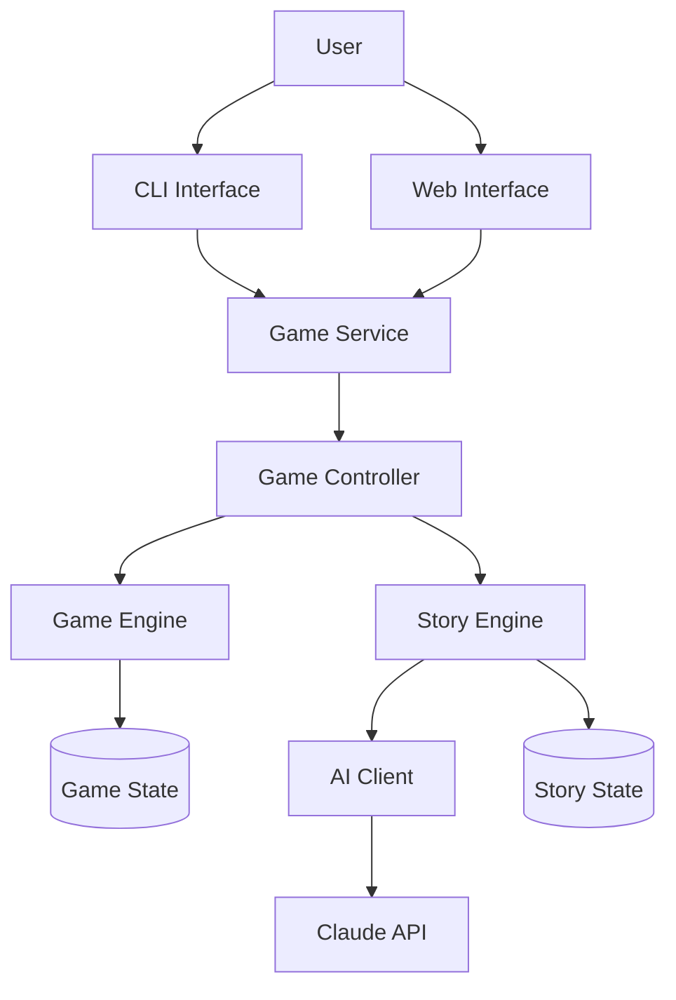

# Fire Whisper RPG - System Architecture

## Overview

This document describes the high-level architecture of the Fire Whisper RPG system. The system is designed to provide an engaging text-based RPG experience with AI-generated narrative content while maintaining strict control over game mechanics and state.

## System Components

The Fire Whisper RPG system consists of the following major components:

1. **Game Engine** - Core game mechanics and state management
2. **Story Engine** - Narrative generation and story management
3. **AI Integration** - Integration with AI services for text generation
4. **Game Controller** - Orchestration of game flow and component integration
5. **Game Service** - Management of game sessions and player interactions
6. **User Interfaces** - CLI and web interfaces for player interaction

## Architecture Diagram

## Component Responsibilities

### Game Engine

The Game Engine is responsible for:

- Managing game state (locations, characters, items, etc.)
- Processing player actions
- Determining action outcomes
- Providing available actions based on context
- Saving and loading game state

The Game Engine follows a code-managed approach where all game mechanics and state changes are handled by code, not by AI. This ensures consistent and predictable gameplay.

### Story Engine

The Story Engine is responsible for:

- Generating narrative text based on game context
- Maintaining story coherence and continuity
- Managing story progression and pacing
- Providing narrative options based on context

The Story Engine uses AI for creative content generation but maintains strict control over story elements and progression.

### AI Integration

The AI Integration component is responsible for:

- Communicating with AI services (Claude API)
- Formatting prompts for AI
- Processing AI responses
- Handling AI service errors and fallbacks

The AI Integration component provides a clean interface for the Story Engine to use AI services without being tightly coupled to any specific AI provider.

### Game Controller

The Game Controller is responsible for:

- Orchestrating game flow
- Integrating Game Engine and Story Engine
- Processing player turns
- Managing game sessions

The Game Controller serves as the main integration point between the domain components (Game Engine, Story Engine) and the application services.

### Game Service

The Game Service is responsible for:

- Managing game sessions
- Creating and configuring game controllers
- Processing player turns
- Saving and loading games

The Game Service provides a clean interface for the user interfaces to interact with the game system.

### User Interfaces

The User Interfaces are responsible for:

- Presenting game content to the player
- Collecting player input
- Displaying available actions
- Providing feedback on action outcomes

The system supports multiple user interfaces (CLI, web) that interact with the game through the Game Service.

## Data Flow

### Starting a New Game

1. User selects character and saga
2. User Interface calls Game Service to create a new game
3. Game Service creates a Game Controller with Game Engine and Story Engine
4. Game Controller initializes game state
5. Story Engine generates opening narrative using AI
6. Game Engine provides available actions
7. Game Service returns initial game state to User Interface
8. User Interface displays narrative and available actions

### Processing a Player Turn

1. User selects an action
2. User Interface sends action to Game Service
3. Game Service forwards action to Game Controller
4. Game Controller sends action to Game Engine
5. Game Engine processes action and updates game state
6. Game Controller gets updated game context
7. Game Controller sends context to Story Engine
8. Story Engine generates narrative using AI
9. Game Engine provides new available actions
10. Game Controller returns updated game state to Game Service
11. Game Service returns updated game state to User Interface
12. User Interface displays narrative and available actions

## Key Design Decisions

### Code-Managed Game State

All game state and mechanics are managed by code, not by AI. This ensures:

- Consistent and predictable gameplay
- Clear separation of concerns
- Easier debugging and testing
- Better control over game balance

### AI for Creative Content Only

AI is used only for creative content generation (narrative text), not for game mechanics or state changes. This ensures:

- Consistent game mechanics
- Predictable gameplay
- Better control over game balance
- Reduced dependency on AI quality

### Clear Interface Boundaries

The system uses clear interface boundaries between components. This ensures:

- Loose coupling between components
- Easier testing and mocking
- Flexibility to change implementations
- Better separation of concerns

### Domain-Driven Design

The system follows domain-driven design principles. This ensures:

- Clear separation of concerns
- Better alignment with business requirements
- More maintainable codebase
- Easier to understand and extend

## Technology Stack

- **Programming Language**: Python
- **AI Service**: Claude API (Anthropic)
- **Web Framework**: Flask (for web interface)
- **Frontend**: HTML, CSS, JavaScript
- **Data Storage**: In-memory (for now), with option to add persistence

## Future Extensions

The architecture is designed to be extensible in the following ways:

### Additional AI Providers

The AI Integration component can be extended to support additional AI providers:

- OpenAI GPT
- Mistral AI
- Local LLMs

### Persistent Storage

The system can be extended to support persistent storage:

- Database storage for game state
- Cloud storage for save games
- User authentication and profiles

### Enhanced Game Mechanics

The Game Engine can be extended with additional mechanics:

- More complex combat system
- Inventory management
- Character progression
- Quest system

### Multiplayer Support

The architecture can be extended to support multiplayer:

- Shared game worlds
- Player interaction
- Collaborative storytelling